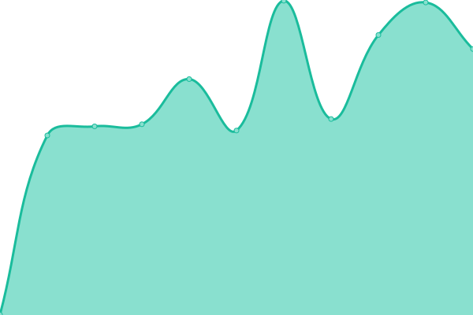

# [📈 Live Status](https://status.charlie-cloud.hu): <!--live status--> **🟧 Partial outage**

This repository contains the open-source uptime monitor and status page for [TTRCharlie](https://status.charlie-cloud.hu), powered by [Upptime](https://github.com/upptime/upptime).

With [Upptime](https://upptime.js.org), you can get your own unlimited and free uptime monitor and status page, powered entirely by a GitHub repository. We use [Issues](https://github.com/TTRCharlie/Charlie-Cloud-Sites-Uptime/issues) as incident reports, [Actions](https://github.com/TTRCharlie/Charlie-Cloud-Sites-Uptime/actions) as uptime monitors, and [Pages](https://status.charlie-cloud.hu) for the status page.

<!--start: status pages-->
<!-- This summary is generated by Upptime (https://github.com/upptime/upptime) -->
<!-- Do not edit this manually, your changes will be overwritten -->
<!-- prettier-ignore -->
| URL | Status | History | Response Time | Uptime |
| --- | ------ | ------- | ------------- | ------ |
|  [Minecraft server player tracker](https://mmst-tracker.charlie-cloud.hu) | 🟩 Up | [minecraft-server-player-tracker.yml](https://github.com/TTRCharlie/Charlie-Cloud-Sites-Uptime/commits/HEAD/history/minecraft-server-player-tracker.yml) | 

 664ms
     
 | 

<a href="https://status.charlie-cloud.hu/history/minecraft-server-player-tracker">100.00%</a>
    

|  [Git](https://git.charlie-cloud.hu) | 🟩 Up | [git.yml](https://github.com/TTRCharlie/Charlie-Cloud-Sites-Uptime/commits/HEAD/history/git.yml) | 

 960ms
     
 | 

<a href="https://status.charlie-cloud.hu/history/git">100.00%</a>
    

|  [Paste](https://paste.charlie-cloud.hu) | 🟩 Up | [paste.yml](https://github.com/TTRCharlie/Charlie-Cloud-Sites-Uptime/commits/HEAD/history/paste.yml) | 

 918ms
     
 | 

<a href="https://status.charlie-cloud.hu/history/paste">100.00%</a>
    

|  Web Panel | 🟩 Up | [web-panel.yml](https://github.com/TTRCharlie/Charlie-Cloud-Sites-Uptime/commits/HEAD/history/web-panel.yml) | 

 948ms
     
 | 

<a href="https://status.charlie-cloud.hu/history/web-panel">100.00%</a>
    

|  Cloud Storage | 🟥 Down | [cloud-storage.yml](https://github.com/TTRCharlie/Charlie-Cloud-Sites-Uptime/commits/HEAD/history/cloud-storage.yml) | 

 762ms
     
 | 

<a href="https://status.charlie-cloud.hu/history/cloud-storage">99.86%</a>
    

|  Another Uptime monitoring | 🟥 Down | [another-uptime-monitoring.yml](https://github.com/TTRCharlie/Charlie-Cloud-Sites-Uptime/commits/HEAD/history/another-uptime-monitoring.yml) | 

 2801ms
     
 | 

<a href="https://status.charlie-cloud.hu/history/another-uptime-monitoring">100.00%</a>
    

<!--end: status pages-->

[**Visit our status website →**](https://status.charlie-cloud.hu)

## 📄 License

- Powered by: [Upptime](https://github.com/upptime/upptime)
- Code: [MIT](./LICENSE) © [TTRCharlie](https://status.charlie-cloud.hu)
- Data in the `./history` directory: [Open Database License](https://opendatacommons.org/licenses/odbl/1-0/)
